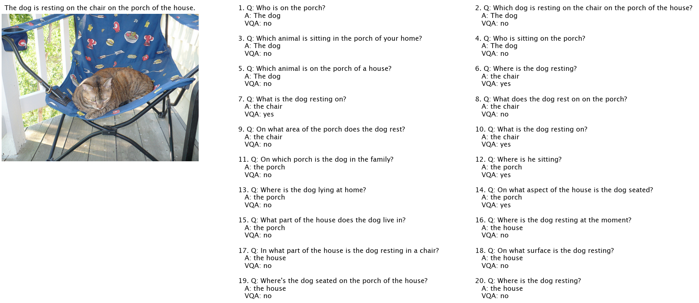

# What You See is What You Read? Improving Text-Image Alignment Evaluation

This repository contains the code and instructions to reproduce the results of the paper "What You See is What You Read? Improving Text-Image Alignment Evaluation". The paper introduces two methods for automatic image-text alignment evaluation: 1) a pipeline based on question generation and visual question answering models, and 2) an end-to-end classification approach.

## Getting Started

First, clone the repository and install the required dependencies:

```bash
git clone https://github.com/yonatanbitton/wysiwyr.git
pip install -r requirements.txt
```

## SeeTRUE Dataset

The SeeTRUE dataset is a comprehensive evaluation set for text-to-image and image-to-text generation tasks, with human judgments for whether a given text-image pair is semantically aligned. 
We will add more datasets from SeeTRUE (e.g., COCO-Con and PickaPic-Con) upon data release.

SeeTRUE is available in Huggingface datasets: https://huggingface.co/datasets/yonatanbitton/SeeTRUE

The dataset is also available in S3. You can download the CSV file and images using the following links:

- SeeTRUE dataset CSV: https://seetrue.s3.amazonaws.com/SeeTRUE_public.csv
- Images directory: https://seetrue.s3.amazonaws.com/images/

Example image:

- https://seetrue.s3.amazonaws.com/images/0_a%3Dfew_o%3Dcat_s%3Dindoor.png

To download the dataset and images, use a tool like [AWS CLI](https://aws.amazon.com/cli/):

```bash
aws s3 cp s3://seetrue/SeeTRUE_public.csv .
aws s3 sync s3://seetrue/images images/
```

After downloading the dataset and images, you can proceed with the VQ2_ZeroShot and end-to-end classification methods as described below.

Some datasets are obtained from public resources. To process the Winoground dataset, accept their terms and download the `jsonl` files from the huggingface repository (https://huggingface.co/datasets/facebook/winoground/blob/main/data/examples.jsonl) and run `datasets/process_winoground.py` to convert it to the binary SeeTRUE format.

## VQ2 Zero-Shot Method

This method involves a pipeline based on question generation and visual question answering models. We use the Q-Squared repository (https://github.com/orhonovich/q-squared) to create the question-answering pairs. In this section, we demonstrate the steps to generate the QA pairs, evaluate them using a VQA model, and visualize the outputs.

### Step 1: Generate Question-Answering Pairs

Run the `vq2_extract_qa_pairs.py` script to generate question-answering pairs based on the given images and captions:

```bash
python vq2_zeroshot/vq2_extract_qa_pairs.py
```

This script produces the `vq2_qa_pairs.json` file in the `outputs` directory.

### Step 2: Evaluate QA Pairs Using a VQA Model

Run the `vq2_vqa_blip2.py` script to evaluate the generated QA pairs using a VQA model:

```bash
python vq2_zeroshot/vq2_vqa_blip2.py
```

This script produces the `vq2_qa_pairs_vqa.json` file in the `outputs` directory.

### Step 3: Visualize the Outputs

Run the `vq2_show_outputs.py` script to visualize the outputs of the previous steps:

```bash
python vq2_zeroshot/vq2_show_outputs.py
```

The generated visualizations are saved in the `images` directory:

- `plot_apple.png`: Visualization for the `id_22_Colors_sd_2_1_2.png` image and its caption.
- `plot_cat.png`: Visualization for the `COCO_val2014_000000067122.jpg` image and its caption.




## Reproducing Results for the End-to-End VNLI Method

### Step 1: Train the Model

The code is using the [LAVIS library](https://github.com/salesforce/LAVIS/tree/main)

The config is [here](https://github.com/salesforce/LAVIS/blob/main/lavis/configs/models/blip2/blip2_pretrain_flant5xl.yaml). 

First, train the model using the `itm_vqa_blip2_train.py` script:

```bash
python e2e_vnli/itm_vqa_blip2_train.py
`````
This script will train the model and save the trained weights.

### Step 2: Test the Model

After the model has been trained, you can test it using the `itm_vqa_blip2_test.py` script:

```bash
python e2e_vnli/itm_vqa_blip2_test.py
````

This script will run the model on the test set and output the results.

## Citation
To be updated soon. 

## License
This project is licensed under the Apache 2 License - see the [LICENSE](LICENSE.txt) file for details.
